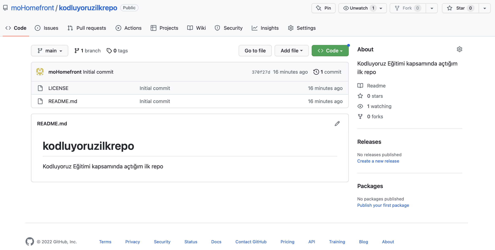

# kodluyoruzilkrepo
Kodluyoruz Eğitimi kapsamında açtığım ilk repo

Bu repo [Kodluyoruz](https://kodluyoruz.org) Front-End eğitimi kapsamında oluşturduğum ilk repo. İçerisinde bir adet README dosyası, bir adet de index.html barındırıyor.


## Installation
---
Öncelikle projeyi clonelayın. (Burada sizin reponuzdan aldığınız link gelecek)
`git clone https://github.com/moHomefront/kodluyoruzilkrepo.git``

## Usage
---
Projeyi cloneladıktan sonra Visual Studio Code programında açınız.

Linux için:
```
cd kodluyoruzilkrepo
code .
```

## Contributing
---
Pull requestler kabul edilir. Büyük değişiklikler için, lütfen önce neyi değiştirmek istediğinizi tartışmak için bir konu açınız.

## License
---
[MIT](https://choosealicense.com/licenses/mit/)